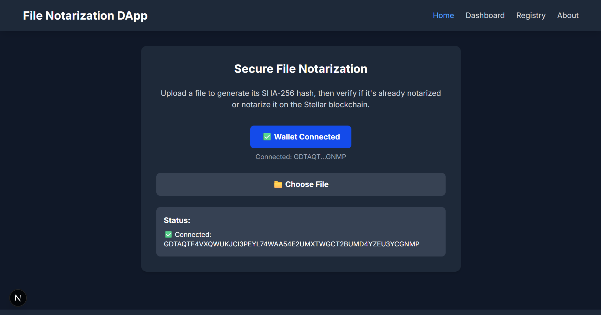
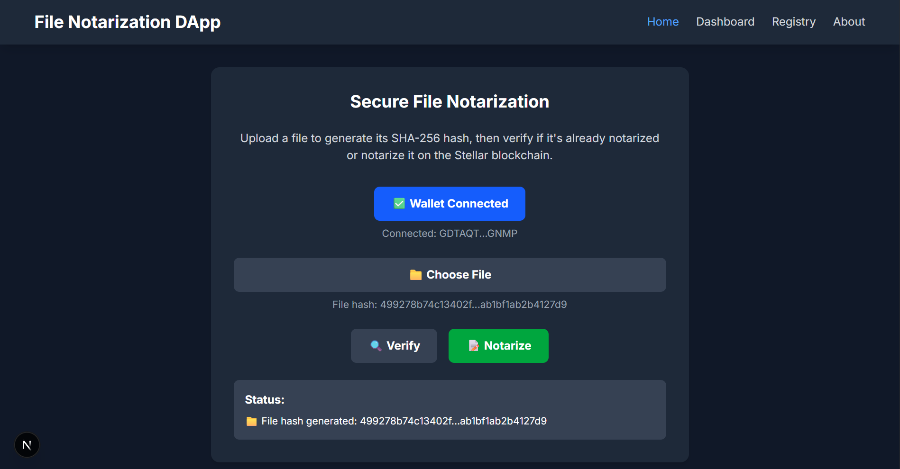
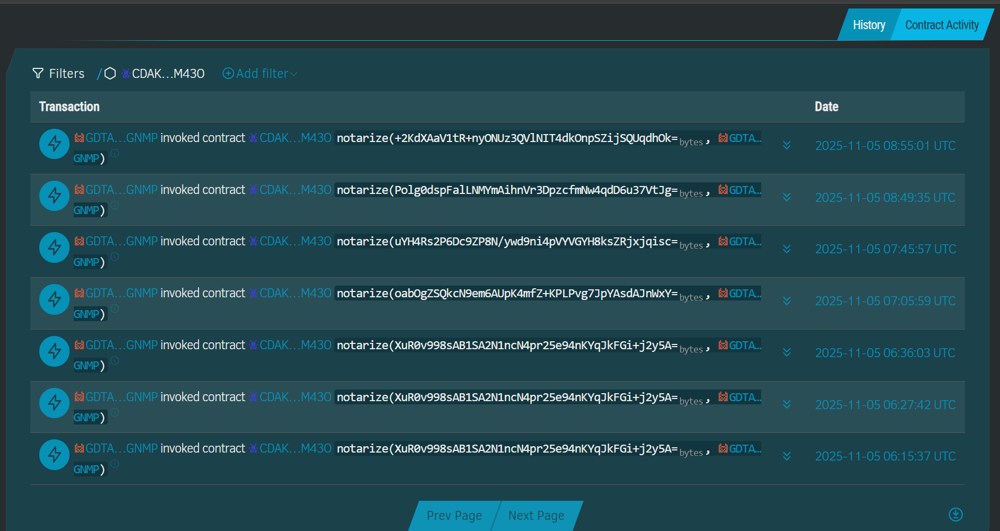
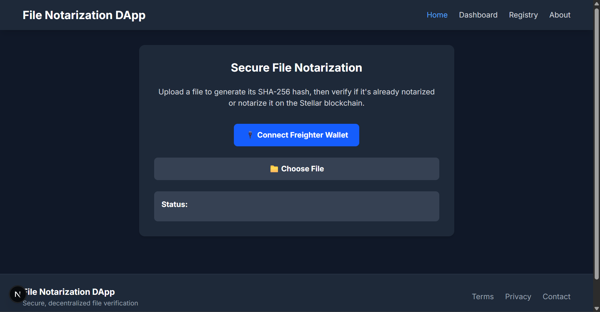

## Project Title 
File Notarization Dapp

## Project Description
A decentralized File Notarization DApp built on the Stellar Soroban smart contract platform.
It allows users to securely notarize and verify files using their SHA-256 hash on the Stellar Testnet, ensuring proof of existence and data integrity.
The frontend is powered by Next.js, with seamless Freighter Wallet integration for signing transactions directly from the browser.

## Project Vision
The vision of this project is to democratize digital trust by leveraging blockchain technology for file verification.
In today’s digital world, proving that a document, image, or file existed at a certain time — and hasn’t been altered — often depends on centralized third parties.

This project aims to eliminate that dependency by providing a transparent, decentralized notarization system built on the Stellar Soroban network.

Using cryptographic hashing (SHA-256) and blockchain immutability, anyone can:

Prove the existence and ownership of a digital file at a specific time.

Verify the authenticity of documents without revealing their content.

Build a tamper-proof audit trail for files like certificates, legal agreements, creative works, and research papers.

The long-term goal is to evolve this DApp into a universal proof layer for digital assets, seamlessly integrating with document management systems, IP registries, and academic verification platforms.

## Key Features
🔐 1. Decentralized File Notarization

Upload any digital file (PDF, image, document, etc.) — the system generates a SHA-256 hash and records it immutably on the Stellar Soroban blockchain.
This serves as a proof of existence and ownership timestamp.

🔍 2. On-Chain Verification

Users can re-upload or paste a file’s hash later to instantly verify whether it’s already notarized — proving its authenticity and that it hasn’t been modified.

💼 3. Freighter Wallet Integration

Seamlessly connects with the Freighter browser extension, allowing users to:

- Connect their Stellar Testnet wallet

- Authorize and sign blockchain transactions directly from the web UI

- View and confirm transaction details securely

⚡4. Built on Stellar Soroban

- Uses Soroban smart contracts written in Rust

- Ensures low transaction costs and fast confirmation times

- Fully deployed on the Stellar Testnet

💻5. Modern Next.js Frontend

- Built with Next.js (React) — clean, minimal, responsive UI

- Supports real-time hash generation using browser’s Crypto API

- Displays transaction hashes and Stellar Explorer links after notarization

🧠6. Privacy-Preserving Design

The actual file is never uploaded to the blockchain — only its cryptographic hash is stored, ensuring complete privacy and integrity protection.

🔗7. CLI + Web Dual Access
The system supports:
- Frontend UI (with wallet interaction)
- Command-Line Interface (CLI) equivalent using the stellar CLI tool
for testing or backend integration.

## Future Scope
🧾 1. IPFS or Arweave Integration

- Store optional file metadata or full files on decentralized storage (IPFS)

- Link IPFS CID with on-chain hash for hybrid verification

👩‍💼 2. Multi-User & Institutional Verification

- Allow organizations to have verified issuer addresses

- Use case: universities issuing verified certificates, legal document registries, etc.

🕵️‍♂️ 3. Zero-Knowledge Proof (ZKP) Support

- Allow users to prove ownership of a file without revealing its actual content or hash.

📧 4. Email Notification & Tracking

- Notify users after successful notarization with transaction ID and blockchain link.

📊 5. Public Explorer Dashboard

- View all notarized file hashes, timestamps, and owners (for transparency/audit).

💰 6. Mainnet Launch

- Migrate from Stellar Testnet to Mainnet for real-world notarization services.

## Contract Details
Contract ID: CDAKWQR3EVSQ2RUO7FLGH42TBSODUMDQCTU7XWS3DV3LULGTVAOCM43O

The Notarization smart contract is written in Rust using the Soroban SDK and deployed on the Stellar Testnet.
It securely stores the SHA-256 hash of a file, along with the owner’s wallet address and a timestamp, ensuring that anyone can later verify the file’s authenticity and existence on-chain.

### Key Information:

- Contract Name: Notarization

- Language: Rust

- Framework: Soroban SDK

- Blockchain: Stellar Soroban Testnet

- Contract ID: CDAKWQR3EVSQ2RUO7FLGH42TBSODUMDQCTU7XWS3DV3LULGTVAOCM43O

- Network Passphrase: Test SDF Network ; September 2015

- RPC URL: https://soroban-testnet.stellar.org

### Functions:

- notarize(env, file_hash, owner) —
This function saves a file’s 32-byte SHA-256 hash on-chain along with the owner’s address and current ledger timestamp.
- It serves as a proof that the file existed and was owned by the given address at that specific time.

- verify(env, file_hash) —
- This function checks whether a given file hash is already stored in the contract.
If found, it returns true, confirming the file was previously notarized; otherwise, it returns false.

### How It Works:

- When a user uploads a file, the frontend generates its SHA-256 hash.

- The connected Freighter wallet signs the transaction and calls the notarize function on the blockchain.

- The contract stores the hash with the owner’s address and timestamp.

- Later, users can verify the same file using the verify function to confirm it exists on-chain.

### Security Notes:

- The actual file is never uploaded to the blockchain — only its hash is stored.

- Every notarization is timestamped directly from the Stellar ledger for authenticity.

- The data is immutable, transparent, and publicly verifiable on the Stellar Testnet.

## Screenshot of UI
